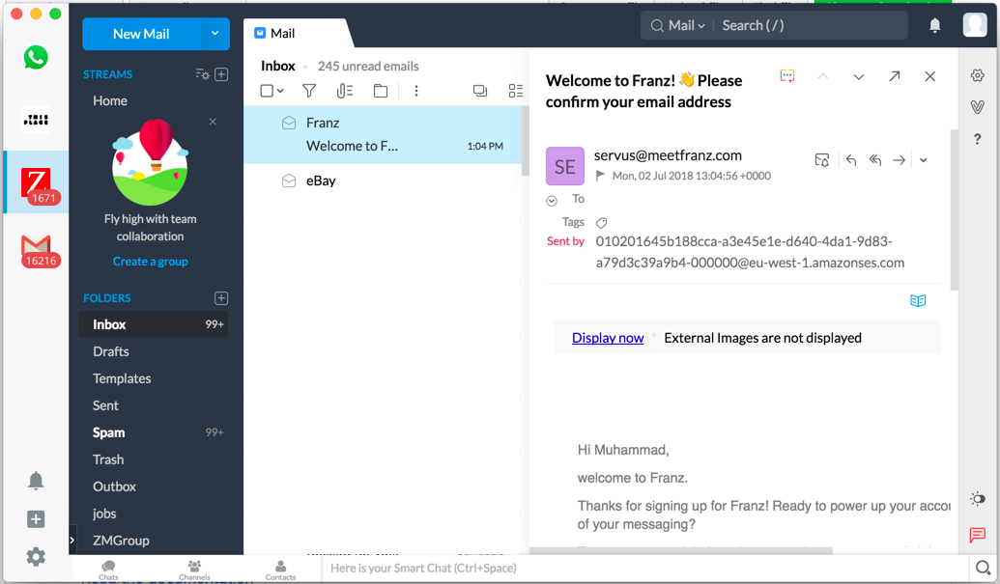

# Zoho Mail Recipe for Franz

This is the Franz 5 Recipe for Zoho Mail

## Requirements
This recipe only works for Franz 5.X, get it now at http://meetfranz.com

## Installation

1. Clone/download the folder `franz-recipe-zoho-mail`.

2. Open the Franz Recipe folder on your machine:
  * Mac: `~/Library/Application Support/Franz/recipes/`
  * Windows: `%appdata%/Franz/recipes/`
  * Linux: `~/.config/Franz/recipes/`

3. Create a `dev` folder if you have not already done so

3. Unzip and copy the `franz-recipe-zoho-mail` folder into the recipes dev directory

4. Restart or Reload Franz

## How to create your own Franz recipes:
* [Read the documentation](https://github.com/meetfranz/plugins)
